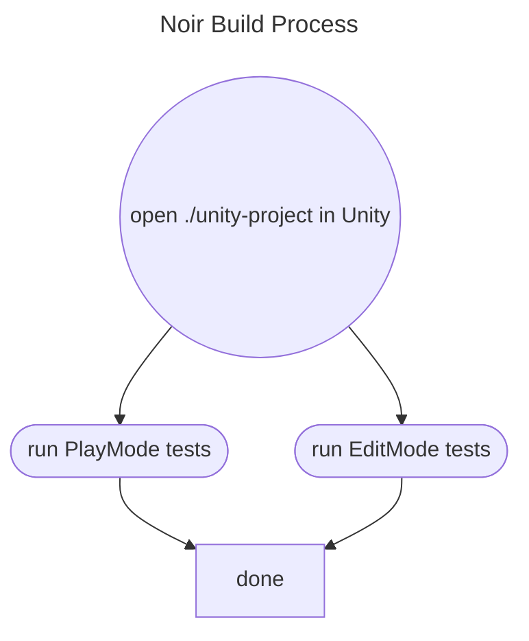
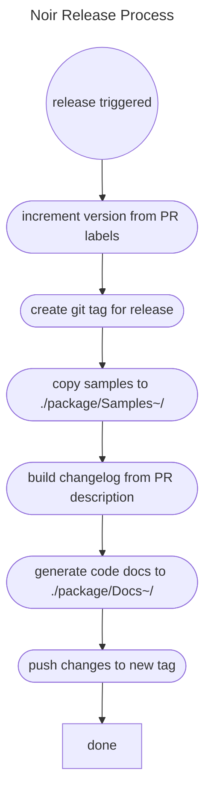

# Noir Library Build & Release Process

## Build process

The build process is run anytime a pull request is opened or updated.

## Release process

The release process is run anytime a pull request is merged into the `stable` branch.

