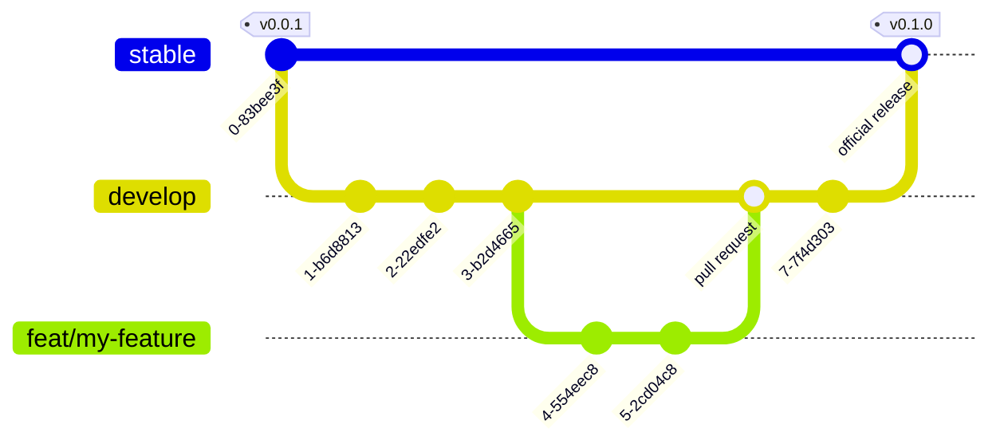

## Development process overview

Development on Noir uses a mainline branching scheme with release tagging. All development occurs off of the `develop` branch. The `stable` branch is used as a merge point to generate new release tags.

The diagram below shows how the git workflow looks as a new feature is started, worked on and then merged into `develop` with a follow-up minor version release.

> Why not create release tags directly off of the `develop` branch?

This is definitely a valid strategy. We prefer to follow a pull request oriented workflow whenever possible as it allows for a natural checkpoint before triggering the next part of a process. Tagging directly off of `develop` wouldn't allow for that.

> Does the `develop` branch cause long delays in shipping smaller releases?

We haven't noticed much delay in getting minor or patch versions released with this model, but it's a risk if maintainers aren't properly keeping up with the repository changes. If a change you've made hasn't been released in a timely manner please do raise an issue and let us know!

## Local environment setup

- Unity 2021.3.22f1 or greater
- VSCode or Rider

### Open the unity-project

1. Open Unity Hub, select "Add Project" and then "Add from disk"
2. In the dialog window, navigate to where you've checked out the noir repository and select the `unity-project` folder.
3. Click "Open Project"
4. You're now all setup to start making changes to the Noir source!
